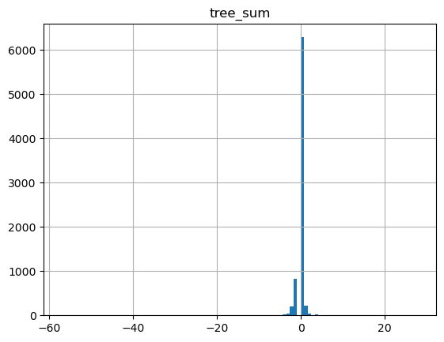

# Final project

> Apply your geospatial data analytics skills to a research question. Please submit a report together with your script to describe your project. A complete report should include the introduction, methodology (data sources, analytics), results, and conclusion. Present your project on April 22.

View [the finished visualization](https://api.mapbox.com/styles/v1/akalenie/clv5gkhdp02js01p6hdl9fcwp.html?title=view&access_token=pk.eyJ1IjoiYWthbGVuaWUiLCJhIjoiY2x2MnRmdHJ4MGV5aDJybGppNHowbHp4biJ9.ezC4CyFggkavaC_HZBGdig&zoomwheel=true&fresh=true#13.53/39.95025/-75.20096) on Mapbox.


## Presentation talking points

- Visualization
    - irregularities in the tree canopy data
- Data sources we're familliar with: trees and buildings
- Compute the value:
    - sum
    - average (size is already visualized)
    - count (+/-) values
- Disribution


- Outliers
    - Warehouses, potentially an artifact or a bug in the code


## Introduction

There used to be a beautiful, old tree next to the parking lot next to my house. Now, the parking lot is and eight-storey building and the tree was cut down. It's cheaper for a developer to cut down a tree and pay a fine than to work around a tree - and they'll only pay the fine if they get caught.

New development is only one reason trees are cut down in cities. Developers may incorperate existing, or new, trees into their plans. Residents object to development in many forms, sometimes with a fervent desire to protect existing trees. City regulators are tasked with enforcing restrictions on developers, including changes to the tree canopy. Using publically available data, we can see what new buildings are displacing the tree canopy.


## Methodology

The analysis will bring together building footprint vector data and tree canopy raster data. A comparison of buildings between 2024 and 2017 will show what buildings have been added. A comparison of raster data between 2024 and 2017 will show changes to the tree canopy. After merging the canopy changes with the subset of buildings that have been added, the resulting visualization will show each building's net, absolute contribution to the tree canopy.


### Data Sources

- A Philadelphia city limits shape comes [the week 4 coursework](https://github.com/xiaojianggis/big-spatial-data/blob/main/lab4-raster-data-manipulation/data.zip).
- [2024 building footprint data](https://opendata.arcgis.com/datasets/ab9e89e1273f445bb265846c90b38a96_0.zip) comes from [Open Data Philly](https://opendataphilly.org/datasets/building-footprints/), accessed April 2024.
- [2017 building footprint data](https://www.pasda.psu.edu/download/philacity/data/PhiladelphiaBuildings2017.zip) comes from a [Penn State online archive](https://www.pasda.psu.edu/download/philacity/data/), accessed April 2024.
- Tree canopy raster data will come from [Google Earth Engine](https://code.earthengine.google.com/36b83b5ff7fb09bc090db04f46f91986). Data from 2017 comes from the calendar year of 2017. Data from 2024 comes from 2023 plus the first four months of 2024.


### Analitics

1. Convert the 2017 building footprint file to EPSG:4326

    The 2024 building footprint file is in EPSG:4326, so we'll convert both files to that coordinate system.

    ```shell
    ogr2ogr -s_srs EPSG:2272 -t_srs EPSG:4326 -f 'ESRI Shapefile' PhilaBuildings2017.shp buildings/PhiladelphiaBuildings2017.shp
    ```

2. Load both files to the database

    Using a PostGIS database named `gus8061` (the course number), create and run the .sql commands to add the data to the database.

    ```shell
    shp2pgsql -s 4326 PhilaBuildings2017 > PhilaBuildings2017.sql;
    psql -d gus8061 -p 5432 -f PhilaBuildings2017.sql;

    shp2pgsql -s 4326 LI_BUILDING_FOOTPRINTS > PhilaBuildings2024.sql;
    psql -d gus8061 -p 5432 -f PhilaBuildings2024.sql;
    ```

3. Extract the data from the database

    Make a table `building_added` using all the buildings added from the 2017 data to today. I'm using a left join to find the 2024 building IDs that did not exist in 2017.

    If a building is on the site of another building that did exist in 2017, that building would show up in this list. This is unlikely but possible. I had hoped to use the PostGRES `except` to find differences between the years, but the vectors didn't line up exactly. I found building ID (`bin`) a more effective method.

    Of 544,910 buildings in 2024, 7,739 were added since 2017.

    ```sql
    create table building_added as
        select b24.*
        from li_building_footprints as b24
        left join philabuildings2017 as b17
        using(bin)
        where b17.gid is null;
    ```

    In order to merge this subset of building footprints with the canopy raster file, we need to export the results as a shapefile.

    ```shell
    pgsql2shp -f building_added.sql gus8061 "SELECT * FROM building_added;";
    ```

4. Build tree canopy difference

    Google Earth Engine provides a cloud-compute, stress-free path to building the tree canopy raster file.

    The javascript uses the image collection `USDA/NAIP/DOQQ` with two different date ranges.

    |Year|Start Date|End Date|
    |-|-|-|
    |2017|2017-01-01|2018-01-01|
    |2024|2022-01-01|2022-06-01|

    The red and near-infrared bands yield a computed ndvi, which is compared to a threshold to detemine if that that tile is (value `1`) or is not (value `0`) in the tree canopy. The difference of those two layers shows the change in the tree canopy over time.

    See work in `canopyDiff.js` or access the code on [Google Earth Engine](https://code.earthengine.google.com/2dd090f09e293eef7aa20561e35c06e4).


5. Merge tree canopy and building footprint

    Run code to create a new shapefile that totals the values of the tiles inside each building footprint.

    There are several ways to parse the overlapping matrix to describing the overlap: sum, average, count of only addition or subtraction. Of those options, I've chosen to use the sum, because it shows an absolute change. Average would effectively control for building size. In the visualization, we'll be seeing relative building size, so that information doesn't need to be part of the analysis. A count of only added trees would be nearly meaningless, since so few buildings add trees. A count of only removed trees would mask interesting outliers that have added trees, and ignore projects that replaced the tree canopy they removed.

    The script `buildings-canopy.ipynb` accepts the `CanopyDiff.tif` raster file and the `building_added.shp` file and yields a `buildings_canopy.shp` file.


6. Visualize the results

    First, convert the shapefile to mbtiles.

    Locally, convert the shapefile to geojson. Upload that file to a configured AWS instance.

    ```shell
    ogr2ogr -f GeoJSON -t_srs crs:84 buildings_canopy/buildings_canopy.geojson buildings_canopy/buildings_canopy.shp;
    scp -i GUS8061.pem buidings_canopy.geojson ubuntu@ec2-xx-xxx-xxx-xx.compute-1.amazonaws.com:/home/ubuntu/;
    ```

    On AWS, use the existing tippercanoe configuration to convert from geojson to mbtiles.

    ```shell
    tippecanoe -ac -an -l buildings_canopy -A “Coursework by Eric Peterson” -o buildings_canopy.mbtiles buildings_canopy.geojson;
    ```

    Download the result locally.

    ```shell
    scp -i GUS8061.pem ubuntu@ec2-xx-xxx-xxx-xx.compute-1.amazonaws.com:/home/ubuntu/buildings_canopy.mbtiles .
    ```

    Now we have a file that's ready to upload to [mapbox](https://studio.mapbox.com/).

    I have used that file to create [a visualization](https://api.mapbox.com/styles/v1/akalenie/clv5gkhdp02js01p6hdl9fcwp.html?title=view&access_token=pk.eyJ1IjoiYWthbGVuaWUiLCJhIjoiY2x2MnRmdHJ4MGV5aDJybGppNHowbHp4biJ9.ezC4CyFggkavaC_HZBGdig&zoomwheel=true&fresh=true#13.53/39.95025/-75.20096) showing buildings that removed canopy in red, buildings that removed no canopy in blue, and buildings that added canopy in green.


## Results

Unsurpisingly, the visualization shows that adding large buildings reduces the tree canopy coverage. Smaller buildings tend to have less to no effect on the canopy.

Still, most buildings are having a small impact on the tree canopy.


Counterintuitively, many buildings are associated with an increase in tree canopy. This could be due to a number of factors. First, buildings added since mid-2022 could be displaying tree canopy changes that happened before construction started. Second, the underlying data could have been collected under different weather conditions.

Overall, this visualization is useful to put in perspective the isolated effects of new development on the tree canopy.


## Extensions

This project could be extended using a more granular raster file. Processing results locally may overcome some limitations.

Developers might remove canopy in their footprint but add street trees just outside the footprint. A much more sophisticated algorithm might attribute canopy changes on surrounding streets to the building footprint.

The visualization could add the canopy change over time as a layer, which would provide neighborhood context for the canopy changes assigned to each building. It would be necessary to convert `CanopyDiff.tif` to 8-bit values.

```shell
GDAL_Translate -of GTIFF -ot BYTE CanopyDiff.tif CanopyDiff8bit.tif
```


## Conclusion

Analysis of geospatial data often confirms our suspicions. This analysis tests our assumptions about the consequences of development.

We see more buildings tagged with zero than someone opposed to a new development might expect. Larger buildings, perhaps built on parcels vacant long enough, or large enough to have grown trees, are more likely to have negative effects on the tree canopy. Neighborhoods can be stronger knowing the effect development tends to have on their canopy, one way or the other.

City regulators might use this data to identify development that has violated their agreements by removing tree canopy. Developers might cut corners, or trees, on the ground, but we can identify their actions on a map.
